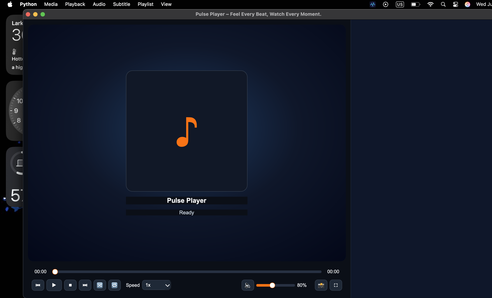
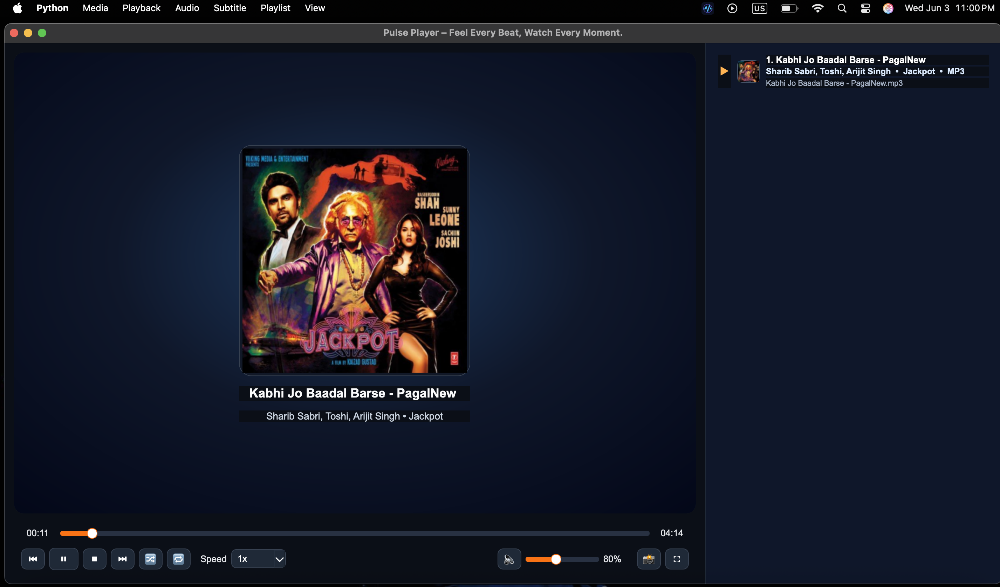
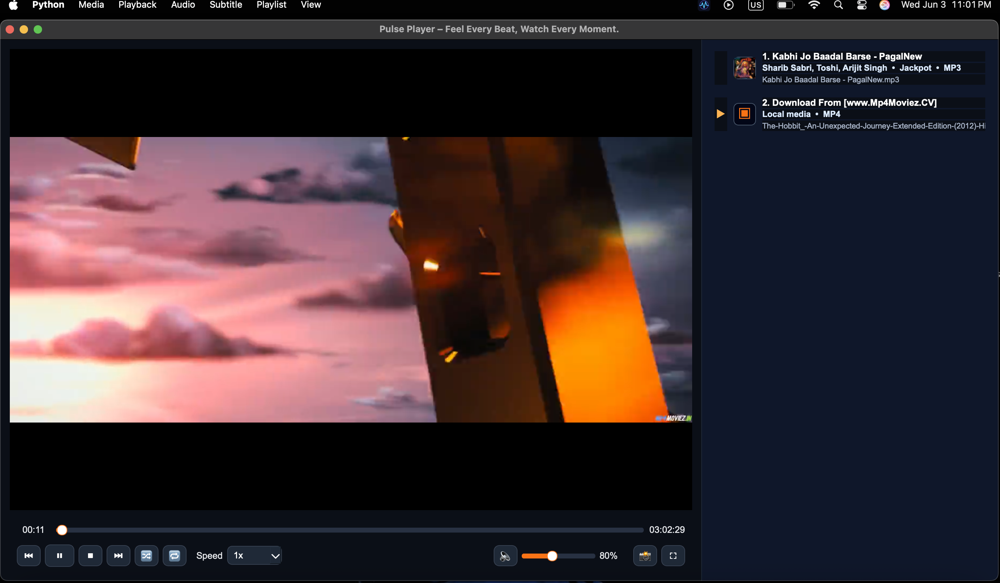
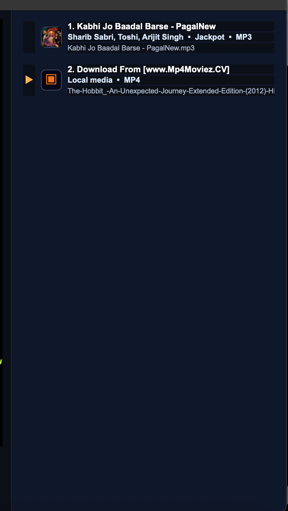

<p align="center">
  
</p>

# 🎵 PulsePlayer
Feel Every Beat. Watch Every Moment.

**PulsePlayer** is a modern desktop media player built with Python, PySide6, and VLC. It delivers a clean user experience for audio and video playback, featuring playlist management, album artwork, media metadata, desktop notifications, and fullscreen playback controls.

---

## ✨ Features

### Audio Playback

* High-quality audio playback powered by VLC
* Album artwork extraction from MP3, FLAC, and M4A files
* Shuffle mode
* Repeat One / Repeat All / Repeat Off
* Playback speed controls
* Volume control with real-time percentage display
* Resume playback support

### Video Playback

* Hardware-accelerated VLC video playback
* Fullscreen mode with auto-hiding controls
* Smooth seeking and timeline navigation
* Video thumbnail support (FFmpeg)

### Playlist Management

* VLC-style playlist panel
* Drag-and-drop media support
* Double-click to play
* Context menu actions
* Current playing indicator
* Playlist numbering and metadata display

### User Interface

* Modern dark theme
* VLC-inspired layout
* Responsive controls
* Album artwork display
* Desktop notifications
* Keyboard shortcuts

### Performance

* Optimized media scanning
* Faster playlist loading
* Reduced UI redraw operations
* Improved VLC startup reliability

---
## 📸 Screenshots

### Main Window


### Music Playback with Album Art


### Video Playback


### Playlist Panel


### Fullscreen Video Mode


---

## 🚀 Installation

### Requirements

* Python 3.10+
* VLC Media Player
* PySide6

Install dependencies:

```bash
pip install -r requirements.txt
```

---

## ▶ Running PulsePlayer

```bash
python main.py
```

---

## ⌨ Keyboard Shortcuts

| Shortcut  | Action         |
| --------- | -------------- |
| Space     | Play / Pause   |
| Shift + N | Next Track     |
| Shift + P | Previous Track |
| S         | Shuffle        |
| L         | Repeat Mode    |
| F         | Fullscreen     |
| M         | Mute           |

---

## 📦 Packaging

### Windows

```bash
pyinstaller --noconfirm --windowed --onefile --name "PulsePlayer" main.py
```

### macOS

```bash
pyinstaller --noconfirm --windowed --name "PulsePlayer" main.py
```

### Linux

```bash
pyinstaller --noconfirm --windowed --name pulse-player main.py
```

---

## 🛠 Technologies Used

* Python
* PySide6
* VLC Media Player
* Mutagen
* SQLite
* FFmpeg

---

## 📄 License

This project is released under the GPL-3.0 license.

---

### PulsePlayer

**Feel Every Beat. Watch Every Moment.**
